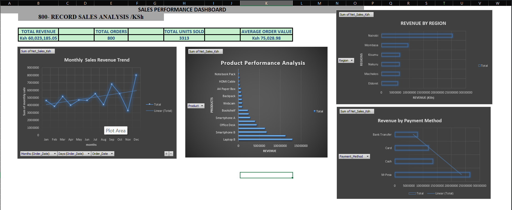

# Sales Data Analysis & Business Intelligence — Excel

## 📊 Project Overview

This project demonstrates how Microsoft Excel can be used to transform raw business data into meaningful insights that support better business decision-making.

The project uses an 800-record sales dataset representing business transactions in Kenya, with all monetary values presented in Kenyan Shillings (KSh).

The analysis covers sales performance, products, profitability, margins, regions, branches, customers and payment methods.

---

## 🎯 Project Objectives

The main objectives of this project were to:

- Clean and prepare raw business data for analysis
- Analyze overall sales performance
- Identify high-performing products and categories
- Analyze profitability and profit margins
- Compare regional and branch performance
- Analyze customer purchasing behavior
- Evaluate payment method performance
- Identify monthly sales trends
- Build an interactive management dashboard
- Generate actionable business insights and recommendations

---

## 🛠️ Tools & Skills

**Tool:**
- Microsoft Excel

**Skills demonstrated:**
- Data Cleaning
- Data Analysis
- Data Transformation
- Excel Formulas
- Pivot Tables
- Pivot Charts
- Dashboard Development
- Business Intelligence
- KPI Analysis
- Profitability Analysis
- Trend Analysis
- Business Insights
- Data-driven Recommendations

---

## 📁 Dataset

The dataset contains **800 business transaction records**.

### Key fields include:

- Order ID
- Date
- Customer
- Branch
- Region
- Product
- Category
- Payment Method
- Quantity
- Unit Price
- Unit Cost
- Discount Rate
- Gross Sales
- Discount
- Net Sales
- Total Cost
- Gross Profit
- Gross Profit Margin

All financial values are expressed in **Kenyan Shillings (KSh)**.

---

## 🧹 Data Cleaning

The dataset was reviewed and prepared before analysis.

The cleaning process included:

- Checking for duplicate Order IDs
- Checking for missing values
- Standardizing date formatting
- Checking numerical fields
- Checking text fields
- Ensuring consistent data formatting
- Verifying calculated financial fields

### Data Quality Results

- Records analyzed: **800**
- Duplicate Order IDs: **None found**
- Missing values: **None found**
- Date formatting: **Standardized**
- Numerical fields: **Checked**
- Text fields: **Checked**

---

## 📈 Sales Performance Analysis

The overall business performance was analyzed using key performance indicators.

| KPI | Result |
|---|---:|
| Total Net Sales | KSh 60,023,185.05 |
| Total Orders | 800 |
| Total Units Sold | 3,313 |
| Average Order Value | KSh 75,028.98 |

These KPIs provide a high-level view of the business's overall sales performance.

---

## 🏆 Product Analysis

Product performance was analyzed using revenue, units sold, gross profit and profit margin.

### Top Products by Revenue

1. Laptop B — KSh 12,978,665.67
2. Laptop A — KSh 11,356,429.19
3. Smartphone B — KSh 6,818,084.07
4. Tablet — KSh 6,403,548.63
5. Office Desk — KSh 4,447,358.86

### Top Products by Units Sold

1. Printer Ink — 224 units
2. Power Bank — 210 units
3. Tablet — 207 units
4. USB Flash Drive — 204 units
5. Backpack — 202 units

An important business insight is that products with the highest sales volume are not necessarily the products generating the highest revenue.

---

## 💰 Profitability Analysis

Profitability was analyzed using gross profit and gross profit margin.

### Top Products by Gross Profit

1. Laptop B — KSh 2,045,101.67
2. Laptop A — KSh 1,950,312.19
3. Smartphone B — KSh 1,249,838.07
4. Tablet — KSh 1,237,794.63
5. Office Desk — KSh 1,153,865.86
6. Printer — KSh 862,221.63

### Highest Average Gross Profit Margins

1. HDMI Cable — 45.82%
2. Pens Pack — 42.74%
3. Notebook Pack — 39.53%
4. Backpack — 39.26%
5. USB Flash Drive — 37.73%

This demonstrates why revenue alone should not be used to determine the most valuable product. High-revenue products and high-margin products can be different.

---

## 🌍 Regional Analysis

Sales performance was compared across different regions.

| Region | Net Sales |
|---|---:|
| Nairobi | KSh 25,262,540.87 |
| Mombasa | KSh 9,459,452.07 |
| Kisumu | KSh 6,568,635.81 |
| Nakuru | KSh 6,472,795.35 |
| Machakos | KSh 6,431,252.59 |
| Eldoret | KSh 5,828,508.36 |

Nairobi generated the highest revenue in the dataset.

---

## 🏢 Branch Analysis

Branch-level performance was also analyzed to identify differences in revenue contribution.

The highest-revenue branches included:

- CBD — KSh 7,776,377.87
- Westlands — KSh 7,559,962.28
- Kilimani — KSh 6,914,605.69

Branch-level analysis can help management identify high-performing locations and investigate opportunities for improvement in lower-performing branches.

---

## 📅 Monthly Sales Analysis

Monthly sales performance was analyzed to identify trends and periods of stronger or weaker performance.

### Highest Month

**December — KSh 7,987,936.58**

### Lowest Month

**November — KSh 3,256,587.05**

The results suggest that management should investigate the factors behind monthly fluctuations, including demand patterns, promotions, pricing and seasonal effects.

---

## 👥 Customer Analysis

Customer analysis was performed to identify high-value and frequent customers.

### Top Customer by Revenue

**John Wanjiku — KSh 1,694,817.62**

Customer purchase frequency and average order value were also examined to understand differences in customer behavior.

This type of analysis can support customer retention and targeted marketing strategies.

---

## 💳 Payment Method Analysis

Revenue was analyzed by payment method.

| Payment Method | Revenue |
|---|---:|
| M-Pesa | KSh 26,538,191.99 |
| Cash | KSh 13,486,648.89 |
| Card | KSh 11,941,902.31 |
| Bank Transfer | KSh 8,056,441.86 |

M-Pesa generated the highest revenue contribution in the dataset.

---

## 📊 Business Intelligence Dashboard


An Excel dashboard was developed to provide management with a visual overview of business performance.

The dashboard includes:

- Total Revenue
- Total Orders
- Total Units Sold
- Average Order Value
- Monthly Sales Revenue Trend
- Revenue by Product
- Revenue by Region
- Revenue by Payment Method

The dashboard is designed to help decision-makers quickly identify important performance patterns.

---

## 💡 Key Business Insights

### 1. Strong Overall Sales Performance

The business generated approximately **KSh 60.02 million** in net sales across 800 orders.

### 2. Electronics Drive Revenue

Electronics generated the largest share of revenue, with approximately **KSh 42.94 million**.

### 3. High Volume Does Not Always Mean High Revenue

Printer Ink had the highest unit volume, while Laptop B generated the highest revenue.

### 4. High Revenue Does Not Always Mean Highest Margin

Laptop B was the leading product by revenue and gross profit, while HDMI Cable recorded the highest average gross profit margin.

### 5. Nairobi Is the Revenue Leader

Nairobi generated approximately **KSh 25.26 million** in net sales.

### 6. December Was the Strongest Month

December generated approximately **KSh 7.99 million**, the highest monthly sales figure in the dataset.

### 7. M-Pesa Is the Dominant Payment Method

M-Pesa generated approximately **KSh 26.54 million** in revenue.

---

## 📌 Business Recommendations

Based on the analysis:

1. **Prioritize high-performing products** such as Laptop B and Laptop A when planning inventory and marketing.

2. **Promote high-margin products** such as HDMI Cable, Pens Pack and Notebook Pack where appropriate.

3. **Investigate regional performance** to understand why some regions generate significantly different revenue levels.

4. **Monitor branch performance** and investigate operational or market factors behind differences in revenue.

5. **Prepare for seasonal demand** by analyzing the factors contributing to strong December performance.

6. **Maintain strong M-Pesa payment availability** while continuing to support alternative payment methods.

7. **Develop customer retention strategies** for high-value and frequent customers.

8. **Use the dashboard regularly** to monitor KPIs and identify changes in business performance.

---

## 📂 Project Structure

```text
sales-data-analysis-excel/
│
├── Sales_Data_Analysis.xlsx
└── README.md
